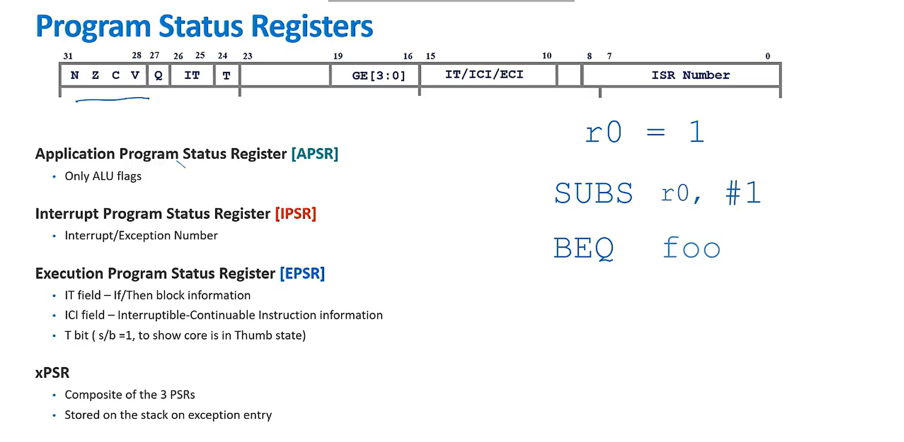
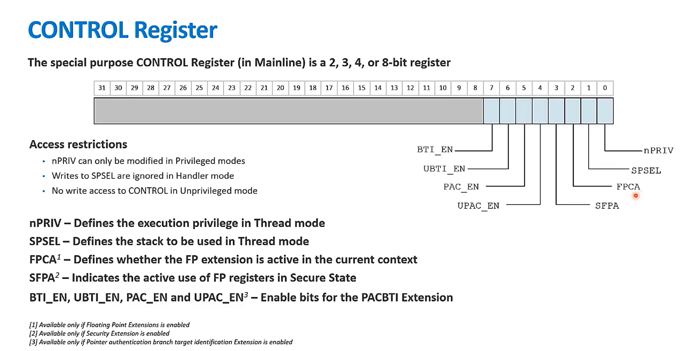
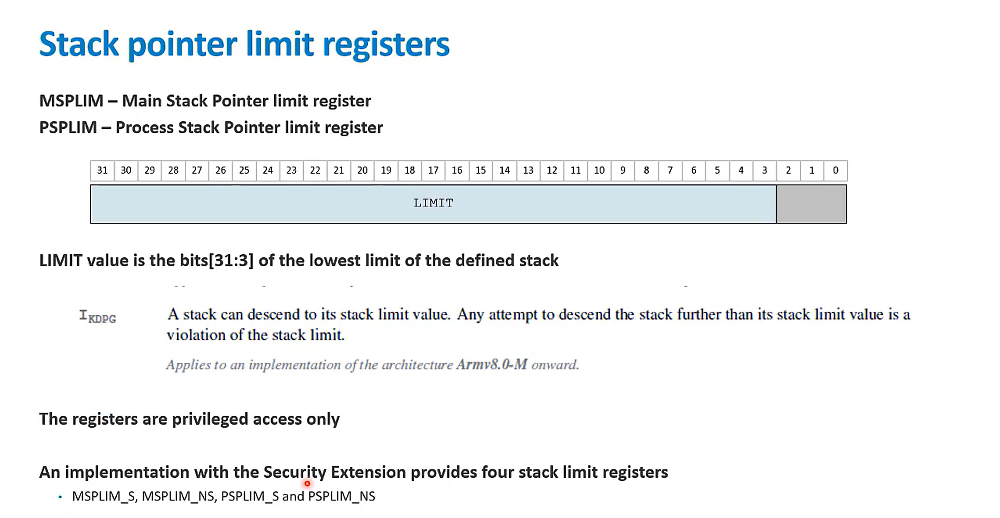
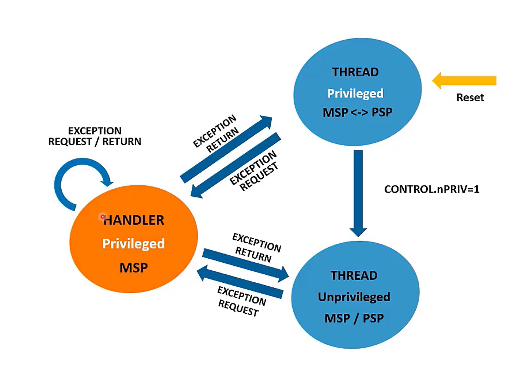
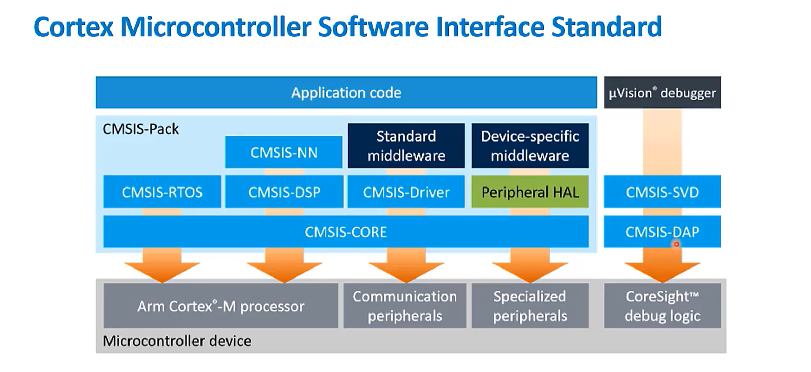
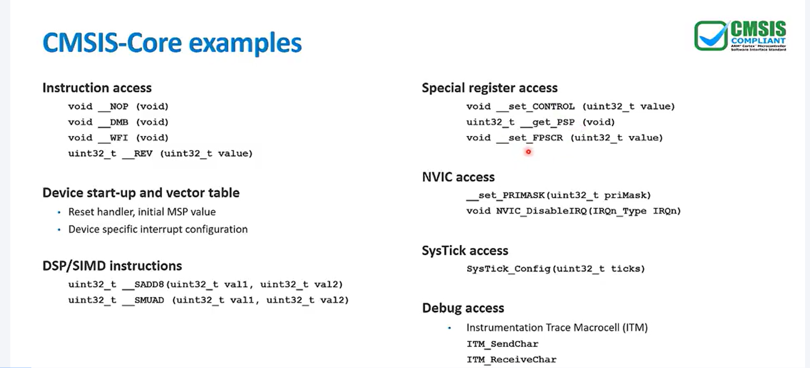
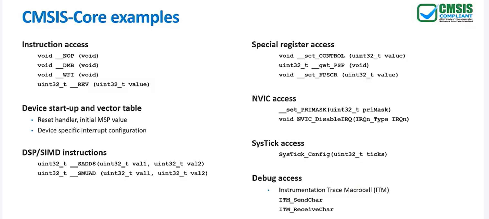

# Armv8-M

## Mainline registers

- Register R0-R7
  - Accessible to all instructions
- Register R8-R12
  - Not avaliable to all (16 bit) instructions
- R13 is the stack pointer (SP)
  - Armv8-M PEs have two banked versions
  - Its points to the oppening of the stack
- R14 is the link register (LR)
  - It stores the return address when a subroutine or function is called, allowing the program to return to the correct location after the function completes.
- R15 is the program counter (PC)
  - holds the memory address of the next instruction to be executed
  - NOT to use directly from assembly
- Special-purpose Registers
  - Program Status Registers (xPSR)
    - APSR(Application Program Status Register)
      - Only ALU flags
    - EPSR (Execution Program Status Register)
      - IT field -> If/Then block information
      - ICI field -> Interruptiable-Continuable Instruction Information
      - T bit -> (s/b =1 to show core is in Thumb state)
    - IPSR (Interrupt Program Status Register)
      - Interrupt/Exception Number
  - 
  - CONTROL
    - FP usage, Stacks and Privileges, PACBTI enable bits
  - 
  - Stack ponters limit registers
    - MSPLIM (Main Stack Pointer Limit Register)
    - PSPLIM (Process Stack Pointer Limit Register)
  - 

  - Other Special Register (Exception handling)
    - PRIMASK (Exception Mask Register)
    - FAULTMASK (Fault Mask Register)
    - BASEPRI (Base Prority Mask Register)

## DATA TYPES

- Armv8-M is 32 bit laod/store architrcture
  - The only memory accessess allowed are loads and stores
  - Most internal registers are 32 bits wide

- When used in relation to Arm architectire the following data types are used
  - Byte       (8 bits)
  - Halfword   (16 bits)
  - Word       (32 bits)
  - Doubleword (64 bits)
- Example with C lang
  - char c;        (8 bits)
  - short b;      (16 bits)
  - int a;        (32 bits)
  - long long d;  (64 bits)

## Privileged Execution

- Handler mode is always Privileged
- Thread mode can be Privileged or non-Privileged, depending on the vaule of **CONTROL.nPRIV**
- The memory mapped control registers in the **System Control Space (SCS)** required privileged access.
- Privileged execution will generate a different memory acess to non-priviliged access.
- When code is executed with non-privileged, Thread mode can execute an **SVC** instruction to generate a supervisor call execption.

## Stack

- **Two run-time model supported.**
  - Single Stack Ponter - MSP for enture applications

  - Two Stack Pointer
    - MSP for Handler Mode (Exception handling)
    - PSP for Thread Mode (Application code)

- **Main Stack Ponter (MSP)**
  - Used by Thread mode out of reset
    - Initaial MSP values is taken from first entry of Vector Table.
  - Always used by Handler Mode.

- **Process Stack Ponter**:
  - Optionally used for Thread Mode
  - PSP is enabled using **CONTROL.SPSEL**.
    - Must be initialized by user before being used.

## Modes Overview

- 

- **Thread Mode**
  - Used for application execution.
  - Can use either
    - Main Stack Pointer (MSP)
    - Process Stack Pointer (PSP)
  - Can be in either
    - Privileged Mode
    - UnPrivileged Mode
  - At rest: MSP + Privileged mode

- **Handler Mode**
  - Used for execption handling
  - Entered on an exception
  - Always in Privileged mode.
  - Only uses Main Stack Ponter

## Exception Handling

- Exception processes in Handler Mode(excpt Reset)
- Exception always run as Privileged.

### Exception Types (Highest to lowest)

1. Reset
2. NMI (Non Maskable Interrupt)
3. Faults (eg: HardFault,UsageFaults, MemManage, BusFault & SecureFault)
4. SVCall  
5. PendSV
6. SysTick Interrupt
7. External Interrupt (IRQs)

## Instruction set support

### Armv8-M Mainline PEs implement the T32 instruction set

- Derived from Armv7-M
  - Mix of 16-bit and 32-bit instructions
  - Instruction length can vary, depending of functionality.
- Load/Store instruction set, no direct manipulation of memory contents.
- Extends Armv7-M by adding Load-Acquire, Store-RElease

### Optional Security Extension is avaliable

- Additional instructions:
  - Function calls between security states (SG,BXNS,BLXNS)
  - Memory protection unit address quires (TT)

## CSMIS (Cortex Microcontroller Software Interface Standard)

## Programmers' Model Resources List

- Getting started with Cortex-M using Arm DS and CMSIS:
https://developer.arm.com/documentation/ka004825/latest

- Armv8-M Architecture Reference Manual:
https://developer.arm.com/documentation/ddi0553/latest

- Cortex-M Resources Blog:
https://community.arm.com/arm-community-blogs/b/architectures-and-processors-blog/posts/cortex-m-resources

- Arm Compiler for Embedded:
https://developer.arm.com/downloads/-/arm-compiler-for-embedded

- CMSIS:
https://github.com/ARM-software/CMSIS_5

- ABI for the Arm Architecture:
https://github.com/ARM-software/abi-aa

