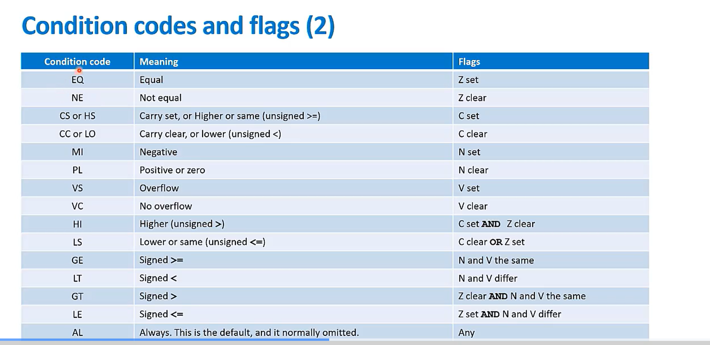

# Assembly programming

## **Arm Architecture is Load/Store architecture.**

- Data must be loaded from memory to CPU, modified, then return back out.
- No direct manipulation of memory content.

### **Instructions consists of**

- Opcode, destination register, first source oprand, optional second source oprand.

```assembly
    OPCODE {<qulifier>}{<condition>} Rd, Rn, ... {Rm}
```

### **T32 Instruction Set**

- Mix of 16-bit and 32-bit instructions.
- Superset of the traditional 16-bit Thumb instruction set.
- optimised for code density from C code.
- Baseline architecture's instruction set is derived from the Armv6-M Thumb instruction set.
  - Limited use of register, constant and condition execution.
- Main extension is derived from the Armv7-M arch and add more instructions.

## Unified Assembler Launguage (UAL)

- UAL gives the ability to write assembly code for all Arm processors.
  - Previously code had to be written exclusively for Aem state (not avaliable in Armv8-M) or Thumb state.
  - UAL allows the execution state to be decided at assembly time.
  - legacy assembler code will still assemble sucessfully.

- UAL also defines `pseudo` instruction thatare resolved by the assembler
  - The assembler will generate the machine code dependent upon the inline directive (eg. .thumb) or the assembler switches (eg. -mcpu)

- Some general rules for UAL.
  - Use of `POP`,`PUSH`.
  - Relaxation of register definitions for Rd and Rn
  - Requiremnt of `S` to be enable flag setting

### Condition codes and flags

- Condtion codes can be used for conditional execution of assembly instructions.
- The codes evalute as `TRUE` or `FALSE` based on the values of the condition flags.
- The condition flags are part if the `Application Program Status Register (APSR)`
- Certain assembly instructions set the condition flag
  - For some instructions that do not set the flags by defaults, the `S` qulifier can be added.

APSR bit | Condition flags | Meaning
---------|-----------------|--------
31       | N               | Negative
30       | Z               | Zero
29       | C               | Carry
28       | V               | Overflow



## Thumb instruction encoding choice

### When assembling for an Armv8-M mainline processor there is often a choice of 16-bit and 32-bit instruction encodings

- The assembler will normally generate 16-bit instructions

### Instruction width specifiers

- Allow you to determine which nstruction width the assembler will use.
- Can be placed immediately after instruction mnemonics:
  - **.W** (wide)
    - Forces a 32-bit instruction encoding
  - **.N** (narrow)
    - Forces a 16-bit instruction encoding
- Errors raised by assembler if not possible

### Disassembly rules

- One-to-one mapping is defined to enusre correct re-assembly
- .W or .N suffix used for cases when a bit pattern which doesn't follow the above rules is disassembled

```flow
      Set bit  Width specifier  
           ^    ^
           |   /
        ADDSEQ.W r0,r1 -> Source oprand #2
       /     |    |_>  Source oprand #1
      V      V
   Opcode  Condition code
```

>this becomes

>Use 32-bit ADD r0 and r1 and store value in r0.

>Set bit when Equal code is true


