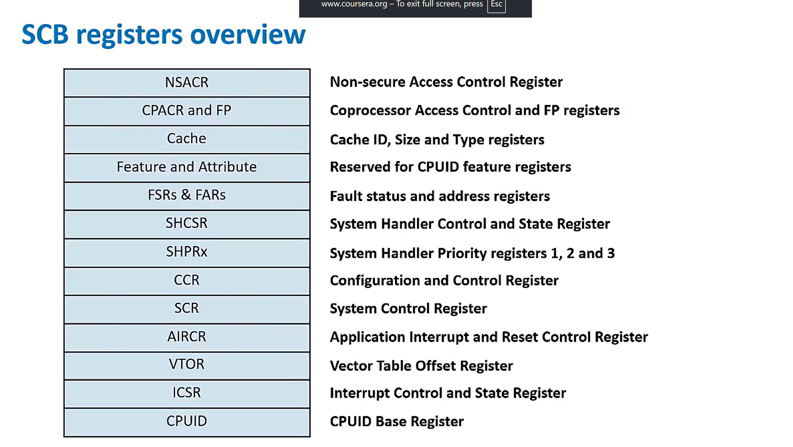
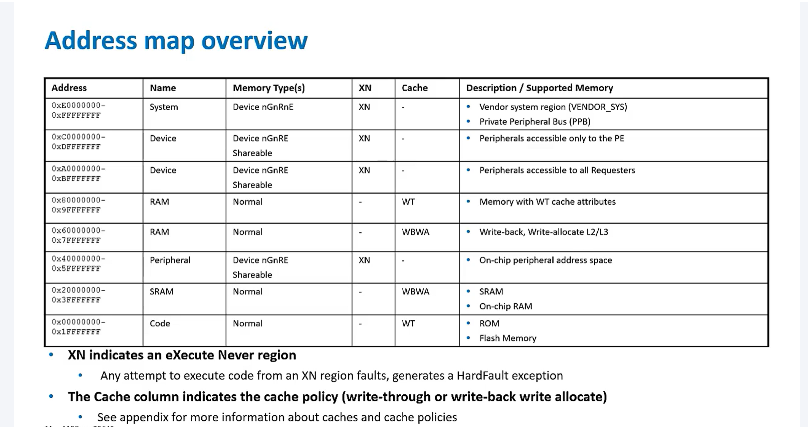
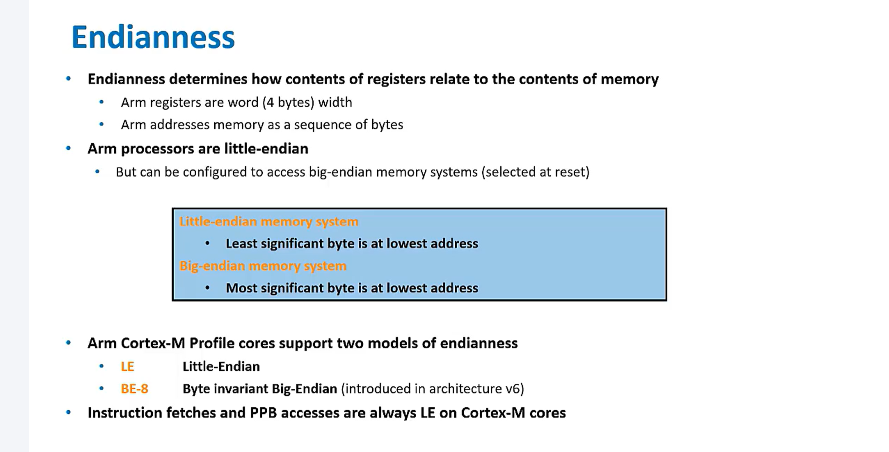

# Memory Address Space

## System Address Map

- ARMv8-M is memory mapped architecture
  - Shared address space for physical memory and processor control & status register.
- Memory is divided into 8x512 MB segments

```
0xffffffff
            System
            Device
            Device
            RAM
            RAM
            Peropheral
            SRAM
            CODE
0x00000000

```

### Memory Segments

#### Code execution allowed region

- **Code 0x00000000-0x1fffffff**
  - Memory to hold instructions
    - Typically ROM or flash memory
- **SRAM 0x20000000-0x3fffffff**
  - Fast SRAM memory, usually off-chip RAM
- **2x RAM 0x60000000-0x9fffffff**
  - Typical RAM memory, usually off-chip RAM

#### Code execution not allowed eXecute Never (XN)

- **Peripheral 0x40000000-0x5fffffff**
  - Peripheral memory space, on-chip
- **2x Device 0xA0000000-0xDfffffff**
  - Peripheral memory space, off-chip
- **System 0xE0000000-0xfffffff**
  - Contains memory mapped registers
  - Segment for control & configuration of the processor
    - Including resources like NVIC, System Timer or Debug
  - Top of memory (511MB) can be used for adding additional implementation defined system space
    - Arm recommends that the top 256MB be used for Vendor Specific System usage
  - System contails 3 parts
    - VENDOR_SYS (its dedicated to soc vendor)
    - Reserved
    - Private Peripheral Bus (PPB)

```
SYSTEM
                                    0xffffffff
0xffffffff |--------|     VENDDOR_SYS
           |        |               0xf0000000
           |        |     (Reserved)
           | System | -->           0xE0100000
0xE0000000 |________|     Private Peripheral BUS (PPB)
                                    0xE0000000

```

### Private Peripheral Bus (PPB)

- The internal PPB is a 1 MB region
- it is always accessed as little endian (32-bit load/store operations)
- In general registers support word accesses only
  - Some register support byte/halfword accesses
- Secure and Non-secure SCS are present
  - if the security extension is implemeted.

| Size                             | region                                  | address                 |
| -------------------------------- | --------------------------------------- | ----------------------- |
| 4KB                              | ROM Table                               | 0xE0100000 - 0xE00ff000 |
| 774,144 bytes = 756 KB ≈ 0.74 MB | Reserved                                | 0xE00ff000 - 0xE0042000 |
| 4KB                              | ETM(Embedded Trace Macrocell)           | 0xE0042000 - 0x0041000  |
| 4KB                              | TPIU (Trace Port Interface Unit)        | 0x0041000 - 0xE0040000  |
| 69,632 bytes = 68 KB             | Reserved                                | 0xE0040000 - 0xE002f000 |
| 4KB                              | Non Secure(NS) SystemControl Space(SCS) | 0xE002f000 - 0xE002E000 |
| 126,976 bytes = 124 KB           | Reserved                                | 0xE002E000 - 0xE000F000 |
| 4KB                              | System Control Space (SCS)              | 0xE000F000 - 0xE000E000 |
| 45056 bytes                      | Reserved                                | 0xE000E000 - 0xE0003000 |
| 4KB                              | FPB (Flash Patch Breakpoint)            | 0xE000300 - 0xE0002000  |
| 4KB                              | DWT (Data Watchpoint and Trace)         | 0xE002000 - 0xE001000   |
| 4KB                              | ITM (Instrumentation Trace Macrocell)   | 0xE001000 - 0xE000000   |

<table class="c-table is-sticky is-striped">
  <caption>
    Table 9.3. SCS address space regions
  </caption>
  <colgroup>
    <col />
    <col />
    <col />
  </colgroup>
  <thead>
    <tr>
      <th colspan="3">
        System Control Space, address range
        <span><code class="hljs">0xE000E000</code></span> to
        <span><code class="hljs">0xE000EFFF</code></span><sup>[<a class="c-anchor"
            href="/documentation/ddi0419/c/System-Level-Architecture/System-Address-Map/System-Control-Space--SCS-#ftn.id6437747"><span
              id="id6437747">a</span></a>]</sup>
      </th>
    </tr>
    <tr>
      <th>Group</th>
      <th>Address Range</th>
      <th>Notes</th>
    </tr>
  </thead>
  <tbody>
    <tr>
      <td rowspan="3">System control and ID registers</td>
      <td>
        <span><code class="hljs">0xE000E000</code></span>-<span><code class="hljs">0xE000E00F</code></span>
      </td>
      <td>Includes the Auxiliary Control register.</td>
    </tr>
    <tr>
      <td>
        <span><code class="hljs">0xE000ED00</code></span>-<span><code class="hljs">0xE000ED8F</code></span>
      </td>
      <td>System Control Block.</td>
    </tr>
    <tr>
      <td>
        <span><code class="hljs">0xE000EF90</code></span>-<span><code class="hljs">0xE000EFCF</code></span>
      </td>
      <td>implementation defined.</td>
    </tr>
    <tr>
      <td>SysTick</td>
      <td>
        <span><code class="hljs">0xE000E010</code></span>-<span><code class="hljs">0xE000E0FF</code></span>
      </td>
      <td>Optional System Timer.</td>
    </tr>
    <tr>
      <td>NVIC</td>
      <td>
        <span><code class="hljs">0xE000E100</code></span>-<span><code class="hljs">0xE000ECFF</code></span>
      </td>
      <td>External interrupt controller.</td>
    </tr>
    <tr>
      <td>Debug</td>
      <td>
        <span><code class="hljs">0xE000EDF0</code></span>-<span><code class="hljs">0xE000EEFF</code></span>
      </td>
      <td>Debug control and configuration. Applies to Debug Extension only.</td>
    </tr>
    <tr>
      <td>MPU</td>
      <td>
        <span><code class="hljs">0xE000ED90</code></span>-<span><code class="hljs">0xE000EDEF</code></span>
      </td>
      <td>
        Optional MPU, see
        <a class="document-topic c-anchor" title="9.5. Protected Memory System Architecture, PMSAv6"
          document-topic-path="/ddi0419/c/System-Level-Architecture/System-Address-Map/Protected-Memory-System-Architecture--PMSAv6?lang=en"
          href="/documentation/ddi0419/c/System-Level-Architecture/System-Address-Map/Protected-Memory-System-Architecture--PMSAv6?lang=en"><span><em>Protected
              Memory System Architecture, PMSAv6</em></span></a>.
      </td>
    </tr>
  </tbody>
  <tbody>
    <tr>
      <td colspan="3">
        <div>
          <div>
            <p>
              <sup>[<a class="c-anchor"
                  href="/documentation/ddi0419/c/System-Level-Architecture/System-Address-Map/System-Control-Space--SCS-#id6437747"><span
                    id="ftn.id6437747">a</span></a>]</sup>
              Unassigned addresses are reserved.
            </p>
          </div>
        </div>
      </td>
    </tr>
  </tbody>
</table>



## Memory model

### Device memory

- 4 variant of device are avaliable
  - Device-nGnRnE - most restrictive
  - Device-nGnRE
  - Device-nGRE
  - Device-GRE    - least restrictive
- Gathering(G/nG)
  - Determines wheather multiple access can be merged into a single bus transaction
  - nG: number/size of accesses on the bus = Number/size of accesses in code
- Re-ordering(R/nR)
  - Determine whether accesses to same device can be re-orderd
  - nR: accesses to teh same IMPLEMENTATION DEFINED block size will appear on the bus in program order.
- Early Write Acknowledgement (E/nE)
  - indicates to the memory system whether a buffer can send acknowledgement
  - nE: The responses should come from the end slaves not buffering in interconnect




### Barrier
- Data Memory Barrier (DMB)
  - checks if next instruction dependicy on DMB if yes it will wait or else next instruction can be executed
- Data Synchronization Barrier (DSB)
  - It completly blocks execution untill all above instruction are completed. 
- Instruction Synchronization Barrier (ISB)
  -  ISB should be executed as it is necessary to flush the pipeline and any instruction prefetch buffers before continuing execution after updating the CONTROL register.
- 