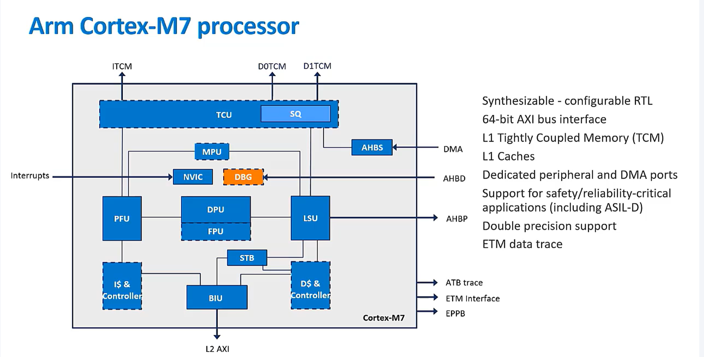

### ARM (Advanced RISC Machine)
ARM was founded in 1990

    - Cortex A 
        - Higgest performance
    - Cortex R
        - Faster Response 
    - Cortex M
        - Smallest/Lowest power usage
    - Secure Core
        - Tamper resistance

##### Development of ARM Arch
    - V4T
        - Halfword and signed halfword
        - byte support system mode
        - thumb instruction set
    - V5TE
        - IMproved Arm/Thumb Interworking
        - CLZ
        - Saturated arithmetic 
        - DSP multiply accumulate instruction
    - v6 
        - SIMD instructions
        - Multi-processing
        - v6 Memory architecture
        - Unaligned data support
        - Extensions :
            - Thumb-2 (v6T2)
            - TrustZone (v6Z)
            - Multicore (v6k)
            - Thumb-only (v6-M)
    - v7
        - Thumb-2
        - NEON
        - TrustZone
        - Virtualization
        - Architecture Profiles:
            - NEON
        - v7-R (Real Time):
            - Hardware divide
        - v7-M (Microcontroller):
            - hardware divide, Thumb-only
    - v8/v9 
        - 64-bit registers
        - Privilege Level
        - New memory model
        - New exceprion model
        - New instructions
        - Arm7 compatible
        - v8-M(Microcontroller):
            - 32-bit only
            - Baseline / Mainline
            - TrustZone for Arm8-M

Note that implementation of the same architecture can be diiferent: 
    - Cortex-M3 : arch v7-M with a 3-stage integer pipeline
    - Cortex-M7 : arch v7-M with a 6-stage integer pipeline

## Arm v6-M cortex processors

## Cortex M3/M4 Plus processor 

## Arm v7-M cortex processor
Streaming strace is added in v7 then v6

| Features | Cortex-M3 | Cortex-M4 |
|:----------:|:-----------:|:-----------:|
|Armv7-M arch variant|Base (Armv7-M) | Extended (Armv7E-M)|
|SIMD & DSP instructions suppoerted | NO | YES|
|Supports optional FPv4-SP extension|NO|YES|
|No of cycles for multiplication operation|1-7|1|
|Support for Fault-robust interface|Present|Absent|
|Bundle|Example System|Intergration Kit|

## Arm v8-M cortex processor
Security is added in v8 than v7

